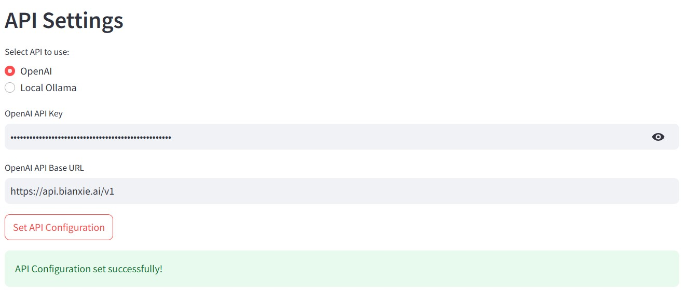
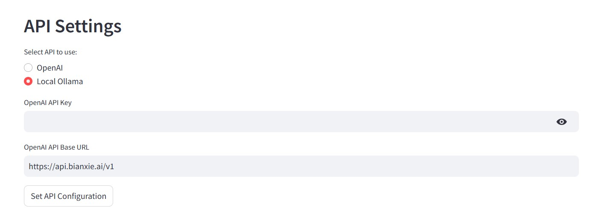
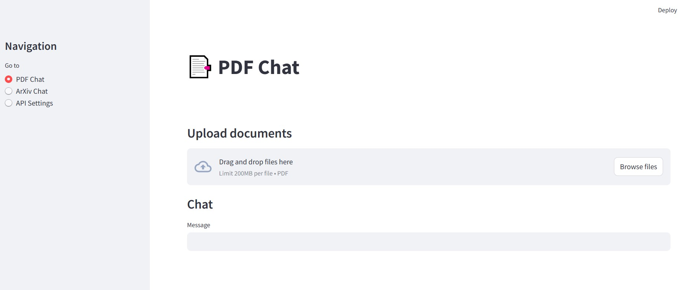
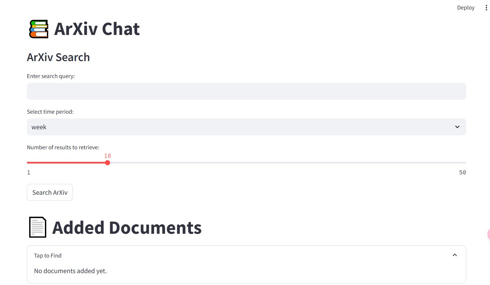

# Chat with ArXiv

[English](#english-version) | [中文](#中文版)

## English Version

### Project Description
A Streamlit-based project offering interaction with PDFs and ArXiv documents, configurable through simple API settings.

### Introduction
Through this interactive application, users can:
- Interact with documents by uploading PDF files.
- Search for literature on ArXiv using keywords, time, and the number of results, and interact with the search results.
- Select papers to build a local Arxiv knowledge base and interact with it.
- Retrieve recent ArXiv documents based on specified time periods.

- Configure API settings to enable functionality.

### Installation and Usage
#### Installation
1. Clone the repository:
   ```sh
   git clone https://github.com/hithd/ArxivRag.git
   cd my-repo
   ```
2. Create a virtual environment and install dependencies:
   ```sh
   python -m venv env
   source env/bin/activate        # On Windows use `env\Scripts\activate`
   pip install -r requirements.txt
   ```

#### Usage
1. Run the application:
   ```sh
   streamlit run app.py
   ```


### Image Demonstrations
Below are examples depicting various parts of the webpage:
- Example 1: OpenAI API setup: 

- Example 2: Local configuration with Ollama:

- Example 3: PDF interaction:

- Example 4: ArXiv interaction:



### Project Structure
```
f:/LocalRag/local-assistant-examples/simple-rag
├── .gitignore
├── app.py
├── requirements.txt
├── api/
│   ├── rag.py
│   └── Testarxiv.py
├── chroma_db/
├── frontend/
│   └── st_pages.py
├── handlers/
│   ├── arxiv_handler.py
│   └── pdf_handler.py
└── utils/
    └── utils.py
```
- `app.py`: Entry point of the application
- `requirements.txt`: Project dependencies
- `api/`: Code interacting with APIs
- `frontend/`: UI pages
- `handlers/`: Logic for handling different document types
- `utils/`: Utilities

### Contribution Guide
1. Fork the repository
2. Create your feature branch (`git checkout -b feature/AmazingFeature`)
3. Commit your changes (`git commit -m 'Add some AmazingFeature'`)
4. Push to the branch (`git push origin feature/AmazingFeature`)
5. Open a Pull Request

### License
This project uses the MIT License. See the [LICENSE](LICENSE) file for more information.

---

## 中文版

### 项目描述
一个基于 Streamlit 的项目，提供与 PDF 和 ArXiv 文档互动的功能，通过简单的 API 设置即可配置和使用。

### 引言
该项目通过一个交互式应用，用户可以：
- 通过上传 PDF 文件与文档互动。
- 使用关键字和时间以及检索数量在 ArXiv 上查找文献并与搜索结果互动。
- 选中论文构建本地Arxiv知识库并与之互动。
- 配置 API 设置以启用功能。

### 安装和使用说明
#### 安装
1. 克隆仓库：
   ```sh
   git clone https://github.com/your-repo.git
   cd your-repo
   ```

2. 创建虚拟环境并安装依赖：
   ```sh
   python -m venv env
   source env/bin/activate        # 在 Windows 上使用 `env\Scripts\activate`
   pip install -r requirements.txt
   ```

#### 使用
1. 启动应用：
   ```sh
   streamlit run app.py
   ```


### 图示演示
以下是网页不同部分的示例：
- 示例 1：OpenAI API 设置： 

- 示例 2：本地 Ollama 配置：

- 示例 3：PDF 查询：

- 示例 4：ArXiv 查询：


### 项目结构和文件组织
```
f:/LocalRag/local-assistant-examples/simple-rag
├── .gitignore
├── app.py
├── requirements.txt
├── api/
│   ├── rag.py
│   └── Testarxiv.py
├── chroma_db/
├── frontend/
│   └── st_pages.py
├── handlers/
│   ├── arxiv_handler.py
│   └── pdf_handler.py
└── utils/
    └── utils.py
```
- `app.py`：应用入口文件
- `requirements.txt`：项目依赖
- `api/`：包含与 API 交互的代码
- `frontend/`：UI 页面
- `handlers/`：包含处理不同类型文档的逻辑
- `utils/`：实用工具

### 贡献指南
1. Fork 这个仓库
2. 创建一个新分支 (`git checkout -b feature/AmazingFeature`)
3. 提交你的改动 (`git commit -m 'Add some AmazingFeature'`)
4. 推送到分支 (`git push origin feature/AmazingFeature`)
5. 打开一个 Pull Request

### 许可证
该项目使用 MIT 许可证 - 请参阅 [LICENSE](LICENSE) 文件以获取更多信息。
